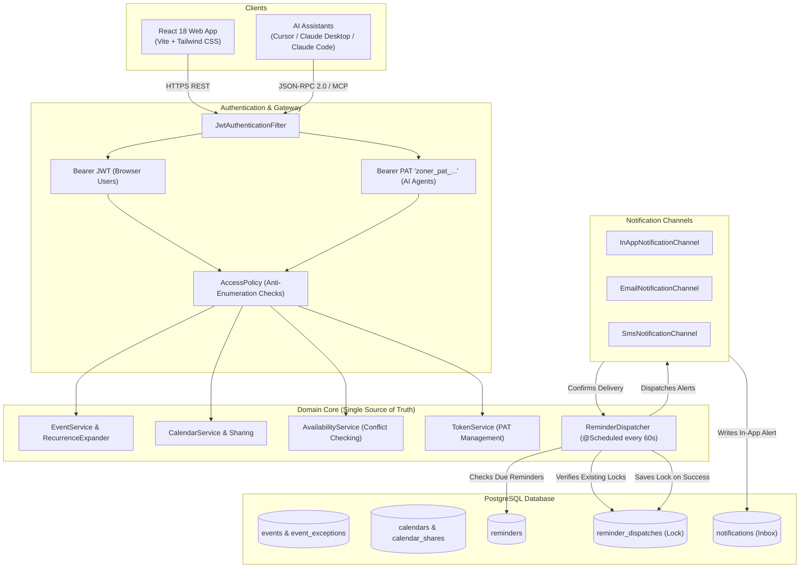

# Zoner — Engineering Architecture, Design Thinking & Operational Guide

> **Author:** Rishav Sharma  
> **Repository:** [Zoner](https://github.com/rishavsair/Zoner)  
> **Live Web Application:** [https://zoner-6uv2.onrender.com](https://zoner-6uv2.onrender.com)  
> **Live API & MCP Backend:** [https://zoner-backend.onrender.com](https://zoner-backend.onrender.com)  
> **Target Audience:** Engineering Reviewers, Technical Evaluators, and Hiring Managers  

---

## 1. Overview & Design Philosophy

A calendar application looks straightforward on the surface, but building one that works reliably across time zones, handles recurring schedules without exploding the database, and delivers timely notifications requires careful systems thinking.

Zoner is built as an **API-first, time-zone aware calendar platform** that treats two types of users as first-class citizens:
1. **People:** Using a fast, responsive web interface built with React 18.
2. **AI Assistants:** Using an embedded Model Context Protocol (MCP) server so tools like Cursor, Claude Desktop, or Claude Code can inspect calendars, check free slots, and create events.

Rather than building a separate bot or proxy for AI interactions, both human users and AI agents talk to the **exact same backend services, validation rules, and permission checks**. If an AI tool tries to book an overlapping event or access a private calendar it doesn't have permission for, it runs into the exact same domain logic as a person clicking on the screen.

### Core Principles I Followed:
- **Never trust local wall-clock time in the database:** Always store timestamps in UTC. Local time is just a display setting for the user looking at the screen.
- **Compute recurrence dynamically instead of pre-generating rows:** If someone sets up a daily meeting for the next two years, don't write 730 rows to the database. Store the rule once and expand it only for the month or week the user is currently viewing.
- **Keep notification delivery locks separate from user inboxes:** If a user deletes an alert from their inbox, the background scheduler shouldn't think delivery failed and send it again.
- **Don't leak information through error codes:** Return a standard `404 Not Found` instead of `403 Forbidden` when someone tries to access a private calendar. That way, unauthorized users cannot tell which calendar IDs exist.

---

## 2. Codebase & Monorepo Structure

Zoner is organized as a **monorepo**. Having both the backend and frontend in a single repository makes it easy to keep database migrations, REST endpoints, and UI components in sync without managing multiple repositories or dealing with version mismatch issues.

```
Zoner/
├── backend/                  # Java 21 / Spring Boot 3 REST API & MCP Server
│   ├── src/main/java/com/zoner/
│   │   ├── auth/             # Users, JWT authentication, and Personal Access Tokens (PATs)
│   │   ├── calendar/         # Calendars, color themes, and sharing permissions
│   │   ├── event/            # Events, recurrence rules (RRULE), exceptions, and attendees
│   │   ├── reminder/         # Background scheduler, reminder locks, and in-app notifications
│   │   ├── mcp/              # Model Context Protocol (JSON-RPC 2.0 endpoints)
│   │   ├── common/           # Error handling, response models, and security access policies
│   │   └── config/           # Spring Security, CORS, UTC serialization, OpenAPI setup
│   ├── src/main/resources/
│   │   ├── db/migration/     # Flyway database migration scripts (V1 through V9)
│   │   └── application.yml   # Spring Boot configuration
│   ├── src/test/             # Unit and integration test suite
│   ├── Dockerfile            # Multi-stage production container build
│   └── pom.xml               # Maven dependencies and plugins
│
├── frontend/                 # React 18 / Vite / Tailwind CSS Web App
│   ├── src/
│   │   ├── api/              # Axios/Fetch client with automatic JWT token attachment
│   │   ├── components/       # Modular UI components grouped by feature
│   │   │   ├── calendar/     # FullCalendar view wrapper and custom calendar styling
│   │   │   ├── events/       # Event creation, detail viewer, and recurring edit dialogs
│   │   │   ├── calendars/    # Create calendar and share permissions modals
│   │   │   ├── settings/     # Personal Access Token generation and AI setup guides
│   │   │   ├── layout/       # Navbar (with unread dot & floating toasts) and Sidebar
│   │   │   └── search/       # Quick search modal for finding events
│   │   ├── context/          # React context providers (AuthContext, ThemeContext, ToastContext)
│   │   ├── pages/            # Top-level page routes (CalendarPage, LoginPage, RegisterPage)
│   │   ├── App.jsx           # Application routing and global route guards
│   │   └── main.jsx          # React DOM entry point
│   ├── package.json          # Frontend dependencies and build scripts
│   └── vite.config.js        # Vite bundler configuration
│
├── render.yaml               # Infrastructure-as-code blueprint for cloud deployment
├── README.md                 # Project overview and quickstart instructions
└── ENGINEERING_README.md     # Deep architecture, design decisions, and operational guide
```

### Why a Monorepo?
1. **Atomic Full-Stack Changes:** When adding a feature like attendee RSVPs or Personal Access Tokens, the backend entity, Flyway migration, controller endpoint, and React modal are committed together in one pull request.
2. **Unified Deployment (`render.yaml`):** A single Render blueprint configures both the Dockerized Spring Boot web service and the static Vite frontend. The backend host URL is automatically passed to the frontend at build time via `VITE_API_URL`, preventing configuration drift between environments.
3. **Simpler Onboarding:** Anyone cloning the repository has everything needed to run both tiers locally without hunting for separate repos.

### Backend Package Breakdown (`backend/src/main/java/com/zoner/`):
- **`auth/`:** Handles registration, password encryption with BCrypt, short-lived JWT generation for browser sessions, and SHA-256 hashed Personal Access Tokens (`zoner_pat_...`) for AI tools.
- **`calendar/`:** Manages user calendars and role-based sharing (`calendar_shares`) with `VIEW`, `EDIT`, and `ADMIN` permissions.
- **`event/`:** Contains core scheduling logic: event CRUD, recurrence rule parsing (`RecurrenceExpander` for RFC 5545 RRULE), series mutation exceptions (`THIS`, `THIS_AND_FOLLOWING`), attendee invitations with RSVP status, and time interval conflict checking (`AvailabilityService`).
- **`reminder/`:** Contains the 60-second background scheduler (`ReminderDispatcher`), the delivery lock table (`reminder_dispatches`), notification channels (`InApp`, `Email`, `Sms`), and the user inbox endpoints (`NotificationController`).
- **`mcp/`:** Native implementation of the Model Context Protocol. Exposes JSON-RPC 2.0 tools over HTTP and Server-Sent Events (SSE) so AI agents can query calendars and create events.
- **`common/`:** Shared utilities, custom exception classes, and `AccessPolicy` (which handles anti-enumeration security by converting unauthorized requests into 404 responses).
- **`config/`:** Spring Security filters, CORS origins, Jackson JSON configuration to guarantee UTC timestamps, and Swagger/OpenAPI setup.
- **`db/migration/`:** Flyway migrations (`V1` to `V9`) that track and apply every schema update sequentially.

### Frontend Folder Breakdown (`frontend/src/`):
- **`pages/`:** High-level page components: `CalendarPage.jsx` (main application screen), `LoginPage.jsx`, and `RegisterPage.jsx`.
- **`components/`:** Feature-scoped UI components:
  - `calendar/`: Wraps FullCalendar v6 and projects events into the user's active time zone.
  - `events/`: Modals for adding events, inspecting details, and choosing whether to edit a single occurrence or the whole series.
  - `calendars/`: Modals for creating new calendars and managing shared collaborator permissions.
  - `settings/`: Modal for generating Personal Access Tokens and copying ready-to-use configuration snippets for Cursor, Claude Desktop, and Claude Code.
  - `layout/`: `Navbar.jsx` (handles user profile, dark mode switch, and the notification bell with a live pulsing green indicator dot and floating toast alerts) and `Sidebar.jsx` (handles calendar toggles and mini-calendar).
- **`context/`:** Shared state management using standard React Context:
  - `AuthContext.jsx`: Keeps track of the current user session and tokens.
  - `ThemeContext.jsx`: Handles light and dark mode toggling, persisted to local storage.
  - `ToastContext.jsx`: Manages temporary floating toast notifications on the screen.
- **`api/`:** Centralized networking layer (`client.js`) using Axios. Automatically adds the Bearer JWT token to outgoing requests and handles error responses uniformly.

---

## 3. Upfront Planning & Changes Made to the Initial Plan

Before writing any code, I drafted an initial design document covering database schemas, entity relationships, and API endpoints. However, as the system was built and tested with realistic calendar scenarios, several initial assumptions turned out to be flawed. 

Here are the five most impactful architectural changes made from the original plan:

### 1. Embedding the AI MCP Server Inside Spring Boot Instead of an External Proxy
- **Initial Plan:** Build a standard REST API for the React frontend, and build a separate bot or proxy service later if AI integrations were needed.
- **Why It Changed:** Running an external proxy creates duplicate code, adds network hops, and makes it easy for AI permissions to fall out of sync with the main app.
- **The Solution:** I embedded the Model Context Protocol (MCP) server directly into the Spring Boot backend (`/api/mcp`) supporting JSON-RPC 2.0 over HTTP and Server-Sent Events (SSE). Both human web users and AI tools pass through the exact same authentication filters, database transactions, validation rules, and access checks.

### 2. Expanding Recurring Events on the Fly Instead of Pre-Generating Rows
- **Initial Plan:** When someone creates a recurring meeting, write all future occurrences directly into the database as individual rows.
- **Why It Changed:** This quickly bloats the database with hundreds of rows for a single event. It also makes infinite recurring events impossible to support and turns simple updates (like changing the meeting time) into heavy batch-update operations across hundreds of records.
- **The Solution:** Switched to dynamic time-window expansion. The database stores only a single master event containing an RFC 5545 recurrence rule (like `FREQ=WEEKLY;BYDAY=MO,WE`). When the frontend asks for events in October, the backend calculates the dates on the fly. Specific changes to single instances are stored in a separate `event_exceptions` table, supporting single edits (`THIS`), series splits (`THIS_AND_FOLLOWING`), and edits to the whole series (`ALL`).

### 3. Dual-Token Authentication (JWT for Humans, PAT for AI Tools)
- **Initial Plan:** Use standard short-lived JWT tokens for everything.
- **Why It Changed:** Short-lived JWTs expire quickly and require interactive browser logins. AI tools running in terminal environments or IDE extensions (like Cursor or Claude Code) need long-lived credentials that can authenticate machine-to-machine.
- **The Solution:** Built a dual-token system in the security layer. Browser users continue using standard short-lived JWTs. For AI assistants, users can generate high-entropy Personal Access Tokens (`zoner_pat_...`). These tokens are hashed with SHA-256 before being stored in the database, can be revoked at any time, track when they were last used, and authenticate directly through the same security filter.

### 4. Multi-Calendar Tenancy and Anti-Enumeration Security
- **Initial Plan:** Simple model where events belonged directly to user accounts.
- **Why It Changed:** In real life, people need multiple calendars (Work, Personal, Side Projects) and need to share specific calendars with team members under different permissions (`VIEW`, `EDIT`, `ADMIN`). In addition, returning `403 Forbidden` for private calendars allowed attackers to guess which calendar IDs exist.
- **The Solution:** Decoupled events into calendar tenant boundaries. Calendars act as individual collections with role-based sharing. When someone tries to access a calendar or event they don't have permission to see, the system returns `404 Not Found` instead of `403 Forbidden`. To an unauthorized caller, private calendars look identical to calendars that don't exist at all.

### 5. Three-Tier Reminder Architecture (Decoupling Locks from Inboxes)
- **Initial Plan:** Track reminder status using simple flags on the event or checking if an inbox notification already exists.
- **Why It Changed:** In background scheduler threads, checking user inboxes created race conditions. More importantly, when a user legitimately read and deleted an alert from their inbox, the scheduler assumed delivery had failed and sent the notification again on the next tick.
- **The Solution:** Separated the reminder system into three distinct tables:
  1. `reminders`: The configuration rule (e.g., 15 minutes before, in-app).
  2. `reminder_dispatches`: The system-level idempotency lock that records that an occurrence was already fired.
  3. `notifications`: The user's personal inbox, which they can read and delete freely without affecting the scheduler.
  Dispatches are only committed after delivery succeeds (`sentCount > 0`), which prevents ghost locks if a transient error occurs during delivery.

---

## 4. System Flow & Architecture Diagram



---

## 5. Thinking Process & Key Design Decisions

### 5.0. How I Approached and Built the System (Step-by-Step Methodology)

To make sure the platform remained stable as complexity grew, I approached development in seven clear phases:

```
[ Phase 1: Invariant Identification & Data Modeling ]
                       │
                       ▼
[ Phase 2: Ingress, Security & Anti-Enumeration ]
                       │
                       ▼
[ Phase 3: Core Domain Services & Conflict Checking ]
                       │
                       ▼
[ Phase 4: Embedded Model Context Protocol (MCP) ]
                       │
                       ▼
[ Phase 5: Reminder Scheduling & Idempotency Hardening ]
                       │
                       ▼
[ Phase 6: Frontend Ergonomics, Live Polling & Toasts ]
                       │
                       ▼
[ Phase 7: Automated Testing, Cold Starts & Deployment ]
```

#### Phase 1: Invariant Identification & Data Modeling
- **Clarified the non-negotiables first:**
  1. *Time storage:* Everything saved in the database must be absolute UTC (`Instant`).
  2. *Recurrence storage:* No pre-generated occurrence rows; compute dates dynamically using RFC 5545 rules.
  3. *Idempotency:* Reminder execution locks must be completely independent of user inbox records.
- **Database schema design:** Designed clean 3NF relational tables in PostgreSQL with proper indexes (`idx_events_time` on `calendar_id, start_at, end_at`) to ensure time-window queries stay fast.

#### Phase 2: Ingress, Security & Anti-Enumeration
- **Unified entry point:** Set up a single Spring Security filter pipeline that accepts both short-lived JWTs (for browsers) and long-lived Personal Access Tokens (for AI assistants).
- **Secure token storage:** AI tokens are generated with high entropy, prefixed with `zoner_pat_`, and stored as SHA-256 hashes so leaked database dumps cannot expose raw tokens.
- **Anti-enumeration rule:** Configured `AccessPolicy` to throw `404 Not Found` instead of `403 Forbidden` on unauthorized resource access.

#### Phase 3: Core Domain Services & Conflict Checking
- **Domain aggregates:** Built clean boundaries between `Calendar`, `Event`, and `EventAttendee`.
- **Conflict detection:** Implemented interval intersection checking ($S_1 < E_2 \land E_1 > S_2$) across all active calendars so users receive immediate warnings if a new event overlaps an existing meeting.
- **Attendee invitations:** Modeled RSVP status tracking (`PENDING`, `ACCEPTED`, `TENTATIVE`, `DECLINED`) with checks ensuring only invited guests can update their attendance.

#### Phase 4: Embedded Model Context Protocol (MCP)
- **Zero-proxy architecture:** Built the MCP JSON-RPC 2.0 endpoints directly into the backend at `/api/mcp`.
- **Tool definitions:** Exposed calendar tools (`list_calendars`, `create_event`, `list_events`, `check_availability`, `search_events`) with strict input schemas.
- **Client documentation:** Added setup templates and cURL tests for Cursor, Claude Desktop, and Claude Code.

#### Phase 5: Reminder Scheduling & Idempotency Hardening
- **Cron polling:** Set up a background task running every 60 seconds (`@Scheduled(cron = "0 * * * * *")`) with a small catch-up window to account for server timing jitter.
- **Fixed detached session bugs:** In background tasks outside HTTP web requests, navigating Hibernate collection proxies threw `LazyInitializationException`. Fixed this by switching to explicit repository queries (`findByEventId`).
- **Delivery verification:** Swapped the save order so that the `reminder_dispatches` lock is only committed after the notification channel confirms successful delivery.

#### Phase 6: Frontend Ergonomics, Live Polling & Toasts
- **FullCalendar integration:** Wired React 18 to FullCalendar v6 with automatic user time-zone projection.
- **Live alerts:** Set up a lightweight polling hook for `/api/notifications/unread-count`. Wired an animated pulsing emerald green dot to the bell icon and built an auto-dismissing (3.5-second) floating alert toast on the top-right whenever a new reminder fires.
- **Dark mode:** Added accessible dark/light theme switching with rich slate tones and frosted glass modal backdrops.

#### Phase 7: Automated Testing, Cold Starts & Deployment
- **Unit and integration tests:** Wrote unit tests covering RSVP transitions, attendee parsing, and reminder idempotency.
- **Zero-drift migrations:** Managed database changes via sequential Flyway migrations (`V1` to `V9`).
- **Render deployment:** Deployed the Docker backend and static frontend to Render, configuring database connection pools and lightweight `/healthz` endpoints to handle free-tier cold starts cleanly.

---

### 5.1. Time-Zone Handling (UTC in Database, Local in the UI)
- **Why this matters:** If an application stores local times like `10:00:00` without time zone context, things fall apart when people travel, when daylight saving time shifts the clocks forward or back by an hour, or when team members in different countries try to schedule a call.
- **How Zoner handles it:**
  - All timestamps (`start_at`, `end_at`, `occurrence_start`, `fire_at`) are stored strictly in **UTC as PostgreSQL `TIMESTAMPTZ` (mapped to Java `java.time.Instant`)**.
  - The user's preferred time zone (e.g., `Asia/Kolkata` or `America/New_York`) is stored in their profile.
  - When the frontend asks for events, timestamps are queried in UTC and converted to the user's active time zone for rendering. This completely separates data storage from display formatting.

### 5.2. Recurrence Engine & RFC 5545 Rules
- **Why this matters:** Pre-generating hundreds of individual database rows for recurring meetings wastes space, makes infinite recurring events impossible, and turns simple edits into slow bulk updates.
- **How Zoner handles it:**
  - Stores a single master event with an RFC 5545 recurrence rule (e.g., `FREQ=WEEKLY;BYDAY=MO,WE;UNTIL=20261231T235959Z`).
  - **Dynamic window expansion:** When viewing a week or month, `RecurrenceExpander` expands the rule only for that specific time window.
  - **Handling edits to recurring events (`event_exceptions`):**
    - **`THIS`:** Modifies or cancels just one single instance without changing the rest of the series.
    - **`THIS_AND_FOLLOWING`:** Ends the original series just before the chosen occurrence and creates a brand-new master series starting from that date forward.
    - **`ALL`:** Updates the original master series definition directly.

### 5.3. The Three-Tier Reminder Architecture
- **Why this matters:** In a system where background schedulers check for due events every minute, reminder state cannot be tracked with a simple boolean on the event. If multiple attendees are invited, or if an event recurs every week, simple flags cause duplicate notifications or missed alerts.
- **The Three Tables:**

| Table | Purpose | Cardinality | Mutability |
| :--- | :--- | :--- | :--- |
| **`reminders`** | **Configuration Rule:** The user's setup (e.g., 15 minutes before, in-app). | 1 row per event reminder setup | Editable by event creator |
| **`reminder_dispatches`** | **System Execution Lock:** Guarantees that across background cycles, an occurrence fires exactly once. | 1 row per event occurrence | Immutable append-only audit lock |
| **`notifications`** | **User Inbox Item:** What the user sees in their notification drawer. | N rows per dispatch (1 per attendee) | Mutable (user can mark read or delete) |

```
[Event: "Weekly Team Standup"]
       │
       ▼ (has reminder rule)
[reminders: 15 min before, IN_APP]
       │
       ▼ (triggers Oct 5 occurrence at 09:45)
[reminder_dispatches: reminder_id=1, occ_start=Oct 5 10:00, status=SENT]
       │
       ├──────────────┬──────────────┐ (delivers to 3 participants)
       ▼              ▼              ▼
[notif: Alice]  [notif: Bob]   [notif: Charlie]
```

- **Deferred Dispatch Lock:** Dispatches are only written to `reminder_dispatches` after successful delivery (`sentCount > 0`). If delivery throws an exception, no lock is saved, allowing retry on the next scheduler run.
- **Decoupled User Deletion:** When a user deletes an alert from their inbox, the `reminder_dispatches` lock stays intact. The scheduler recognizes that the occurrence was already executed and will not send it again.

### 5.4. Security, Access Boundaries & Anti-Enumeration
- **Why this matters:** If an API returns `403 Forbidden` for existing private calendars and `404 Not Found` for nonexistent ones, an attacker can write a simple script to test IDs and discover which calendar IDs belong to real accounts.
- **How Zoner handles it:**
  - `AccessPolicy` enforces strict authorization. If a user asks for a calendar or event they don't have permission to see, the system returns `404 Not Found`.
  - An unauthorized user cannot tell whether a calendar is private or simply doesn't exist.
  - Multi-calendar collaboration uses clear permission levels (`VIEW`, `EDIT`, `ADMIN`) validated at the service layer on every operation.

### 5.5. Model Context Protocol (MCP) as a Native Interface
- **Why this matters:** Modern applications should be accessible to both humans and AI developer assistants. Adding AI integrations usually means writing brittle external scraping scripts or loose webhook bots that bypass application security.
- **How Zoner handles it:**
  - The MCP server is built directly into Spring Boot (`/api/mcp`) supporting JSON-RPC 2.0 over HTTP and Server-Sent Events (SSE).
  - Both human web users and AI tools pass through the exact same authentication filters, database transactions, validation rules, and access checks.
  - AI tools authenticate using revocable Personal Access Tokens (`zoner_pat_...`), enjoying first-class status in the application.

---

## 6. How to Use the Full Functionality of the App

### 6.1. Authentication & Account Access
1. Open the live web application at [https://zoner-6uv2.onrender.com](https://zoner-6uv2.onrender.com).
2. Sign in with the pre-seeded demo account (`demo@zoner.app` / `Password123!`).
3. Or click **"Sign up free"** to register a new account with your own preferred time zone.

---

### 6.2. Calendar Management & Sharing
- **Default Calendar:** Every new account automatically gets a primary "Personal" calendar on signup.
- **Creating Calendars:** Click the `+` button in the left sidebar under "My Calendars". Give it a name, description, and color.
- **Showing / Hiding Calendars:** Check or uncheck calendars in the sidebar to overlay or isolate events.
- **Sharing a Calendar:**
  1. Hover over a calendar in the sidebar and click the **Share** icon.
  2. Enter a teammate's email (e.g., `colleague@zoner.app`) and select their permission:
     - `VIEW`: Read-only access to event details.
     - `EDIT`: Can create, update, and delete events.
     - `ADMIN`: Can manage calendar sharing and delete the calendar.

---

### 6.3. Creating & Managing Events
1. Click **"+ Create Event"** or click directly on any time slot in the calendar grid.
2. Enter Title, Description, Location, and Color.
3. **Time-Zone Flexibility:** Pick start and end times; all conversions to UTC happen automatically.
4. **All-Day Events:** Toggle "All day" for multi-day conferences or reminders.
5. **Conflict Warning:** If the selected time overlaps with an existing event on any active calendar, Zoner flags an immediate conflict alert so you can reschedule.

---

### 6.4. Attendees & RSVP Tracking
1. In the Event modal, go to the **Attendees** section.
2. Enter guest email addresses and names.
3. When guests log in, they can view their invitation and update their RSVP status to **Accepted**, **Tentative**, or **Declined**.
4. The reminder engine automatically routes notifications to all attendees who have not declined the event.

---

### 6.5. Reminders & Live Notification System
1. In the Event modal, add one or more reminders (e.g., *15 minutes before*, *5 minutes before*, or *at time of event*).
2. Choose the notification channel:
   - **In-App:** Saves an alert in the user's inbox drawer and triggers live UI alerts.
   - **Email / SMS:** Sends message logs and writes a fallback in-app copy.
3. **Unread Indicator (Green Dot):** When an unread notification is waiting, a pulsating emerald green dot appears on the notification bell in the top navigation bar.
4. **Floating Toast Popups:** When a reminder triggers while you are using the app, a floating alert card slides into the **top-right corner for 3.5 seconds**, showing the event title, start time, and a "New" badge.
5. **Managing Notifications:** Click the bell icon to open the drawer, mark notifications as read, or delete them.

---

### 6.6. Setting Up AI Assistants (Model Context Protocol)
Zoner includes a fully compliant **Model Context Protocol (MCP)** server embedded directly into the backend (`/api/mcp`).

1. Open the profile dropdown in the top-right and click **"Settings & MCP"**.
2. Click **"Generate Token"** to create a Personal Access Token (`zoner_pat_...`).
3. Select your AI tool:
   - **Cursor:** Copy the configuration snippet into `.cursor/mcp.json`.
   - **Claude Desktop:** Copy the JSON snippet into `claude_desktop_config.json`.
   - **Claude Code:** Run the provided CLI terminal command.
   - **cURL Test:** Run the pre-configured cURL command to verify tool discovery.
4. Your AI assistant can now call tools such as:
   - `list_calendars`: Discover your calendars.
   - `create_event`: Schedule meetings and set reminders using plain English.
   - `check_availability`: Find mutual free slots without double-booking.

---

### 6.7. Dark Mode & Accessibility
- Toggle between Light and Dark mode using the sun/moon icon in the top navigation bar.
- The UI maintains accessible contrast standards, using rich slate backgrounds (`slate-900`/`slate-950`) with brand-indigo accents and frosted-glass modal backdrops.

---

## 7. Verification, Testing & Observability

### 7.1. Automated Test Suite
The codebase is validated by automated unit tests covering business rules, idempotency, and access controls:
```bash
# Run unit tests
./mvnw test -Dtest="AttendeeUnitTest,ReminderDispatcherUnitTest,EventServiceAttendeeTest"
```
- `AttendeeUnitTest`: Validates RSVP state transitions and attendee parsing.
- `ReminderDispatcherUnitTest`: Verifies due reminder calculation, recipient resolution, deferred dispatch saving, and strict idempotency against deleted notifications.
- `EventServiceAttendeeTest`: Validates invitation workflows and permission boundaries.

### 7.2. Production Logging
All lifecycle events emit clear, structured logs for monitoring:
- `[EVENT CREATED]`: Event ID, title, start time, and reminder configurations.
- `[REMINDER EVAL]`: Active reminders evaluated against the reference clock.
- `[REMINDER TRIGGER]`: Event and occurrence identified as due.
- `[REMINDER DISPATCH]`: Recipient resolution and notification delivery.
- `[REMINDER DISPATCH SUCCESS]`: Dispatch record commitment and recipient counts.
- `[NOTIFICATION EVENT]`: In-app notification creation with user IDs and titles.
